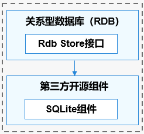

# 关系型数据库<a name="ZH-CN_TOPIC_0000001124534865"></a>

-   [简介](#section11660541593)
    -   [关系型数据库（RDB）](#section1589234172717)
-   [目录](#section161941989596)
-   [关系型数据库（RDB）](#section101010894114)
    -   [约束](#section18387142613414)
-   [相关仓](#section1371113476307)

## 简介<a name="section11660541593"></a>

**关系型数据库（Relational Database，RDB）** 是一种基于关系模型来管理数据的数据库。OpenHarmony关系型数据库基于SQLite组件提供了一套完整的对本地数据库进行管理的机制。

### 关系型数据库（RDB）<a name="section1589234172717"></a>

OpenHarmony关系型数据库底层使用SQLite作为持久化存储引擎，支持SQLite具有的所有数据库特性，包括但不限于事务、索引、视图、触发器、外键、参数化查询和预编译SQL语句。

**图 1**  关系型数据库运作机制<a name="fig3330103712254"></a>




## 目录<a name="section161941989596"></a>

```
//foundation/distributeddatamgr/appdatamgr/
├── relational_store          # 关系型数据库（RDB）
│   ├── frameworks            # 框架层代码
│   │   └── js                # JS API的实现
│   │   │   └── napi          # napi代码实现
│   │   └── native            # 内部接口实现
│   ├── interfaces            # 接口代码
│   │   └── inner_api         # 内部接口声明
│   │       └── native        # C/C++接口
│   └── test                  # 测试用例
│       ├── js                # js用例
│       └── native            # C++用例
```

## 关系型数据库（RDB）<a name="section101010894114"></a>

以下是几个基本概念：

-   **关系型数据库**

    创建在关系模型基础上的数据库，以行和列的形式存储数据。

-   **结果集**

    指用户查询之后的结果集合，可以对数据进行访问。结果集提供了灵活的数据访问方式，可以更方便的拿到用户想要的数据。

-   **SQLite数据库**

    一款轻量级的数据库，是遵守ACID的关系型数据库组件。它是一个开源的项目。


### 约束<a name="section18387142613414"></a>

数据库中连接池的最大数量是4个，用以管理用户的读写操作。

为保证数据的准确性，数据库同一时间只能支持一个写操作。

## 相关仓<a name="section1371113476307"></a>

分布式数据管理子系统

- [distributeddatamgr\_appdatamgr](https://gitee.com/openharmony/distributeddatamgr_appdatamgr)
- [third\_party\_sqlite](https://gitee.com/openharmony/third_party_sqlite)